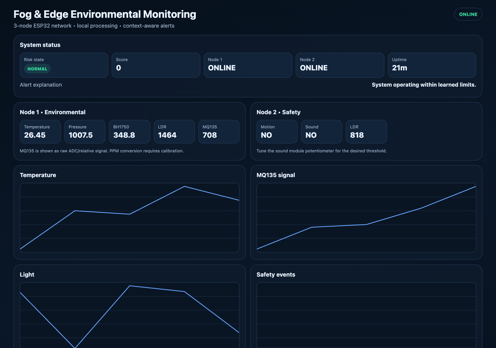
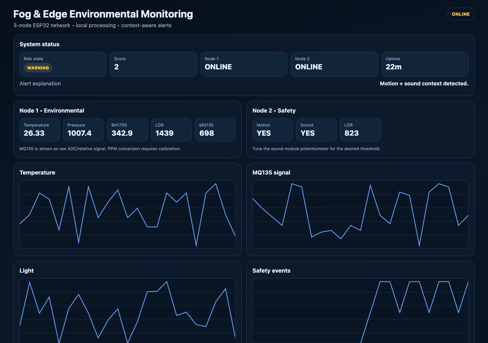
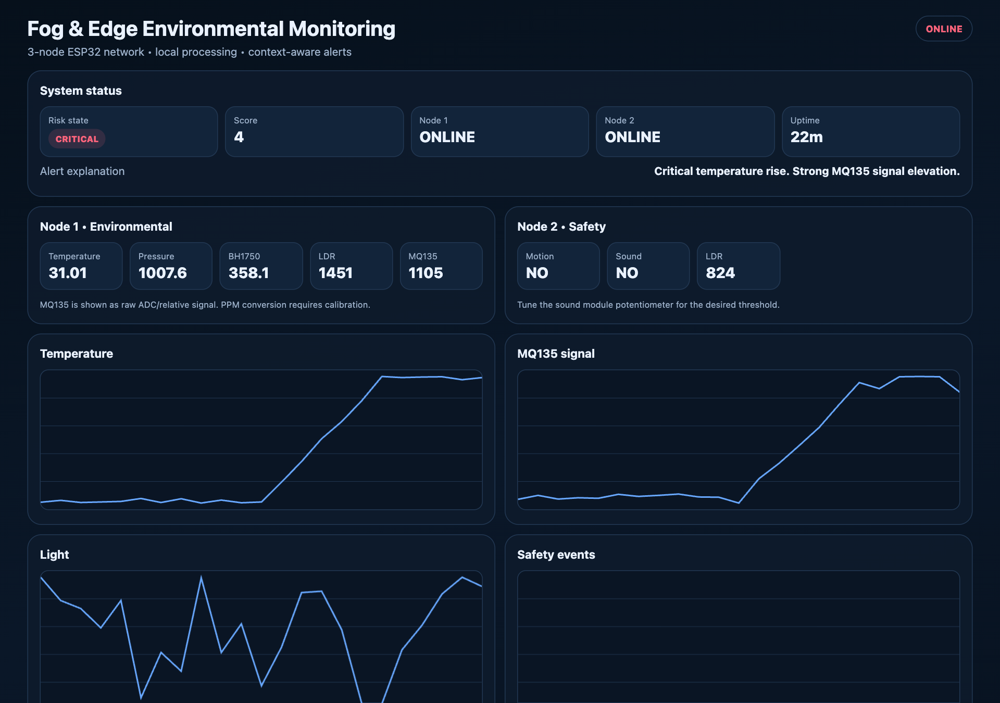
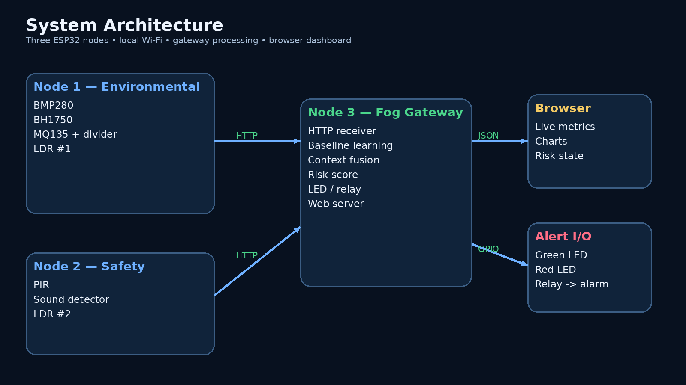
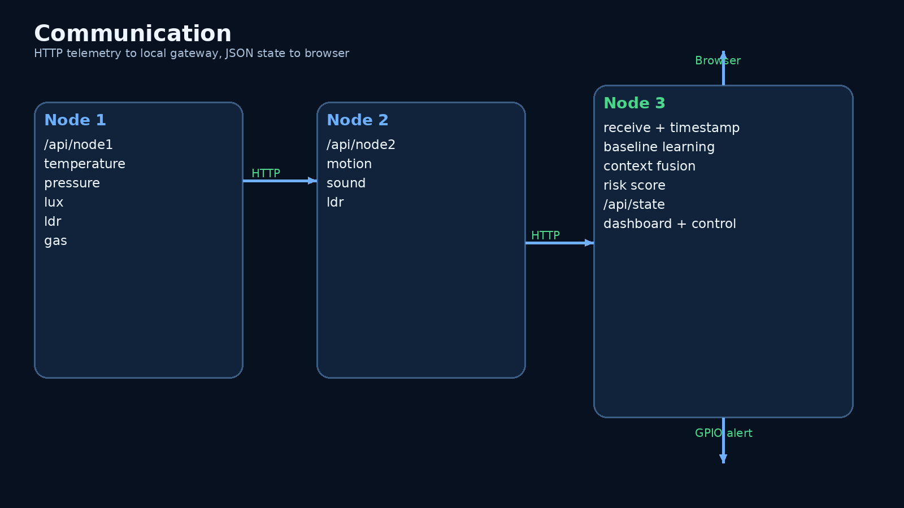
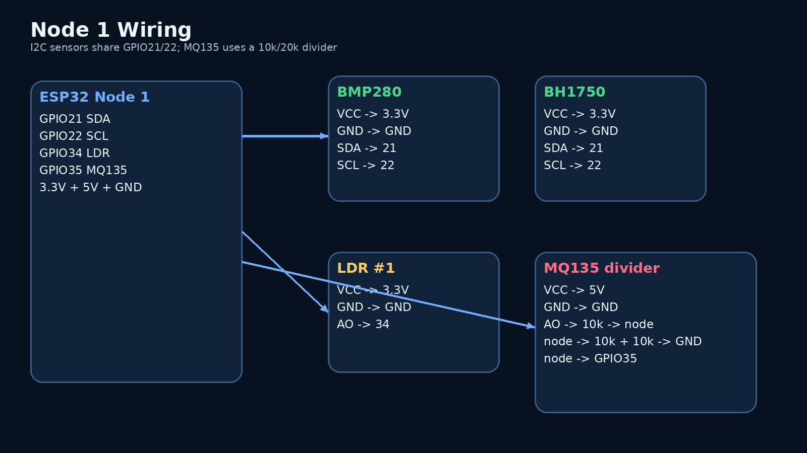
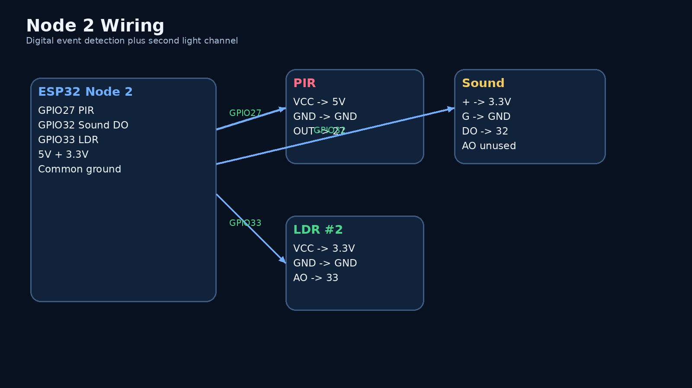
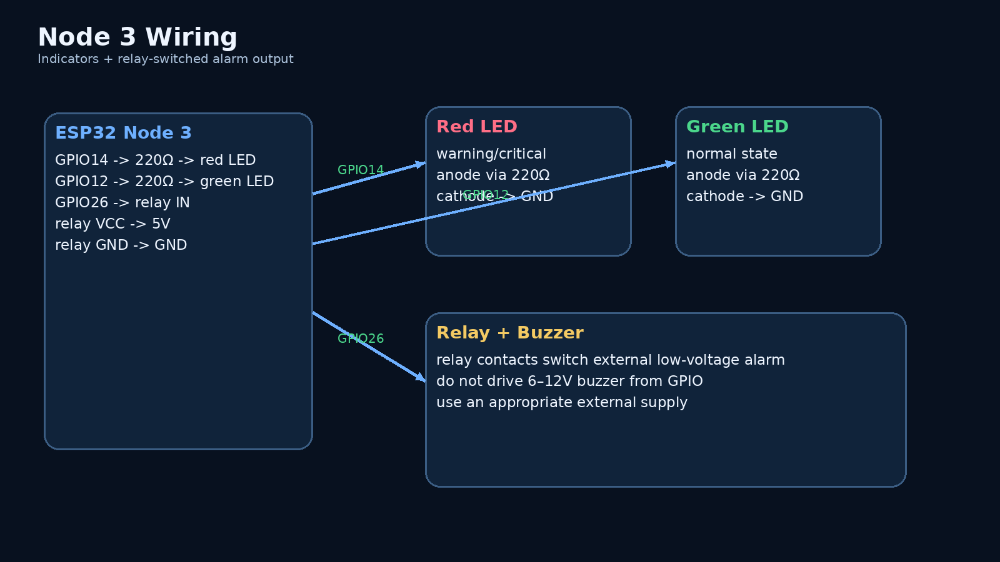
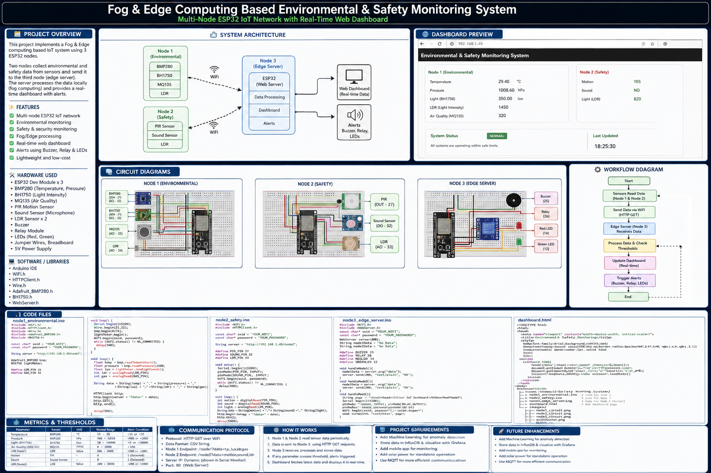
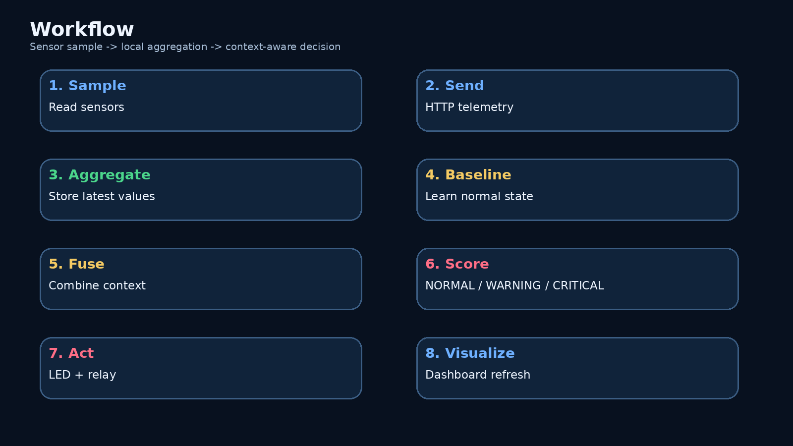

# Fog-Based Multi-Node Environmental Anomaly Detection

A professional, GitHub-ready **Fog & Edge Computing** prototype built around **three ESP32 boards**:

- **Node 1 – Environmental Edge Node:** BMP280, BH1750, MQ135 and LDR.
- **Node 2 – Safety Edge Node:** PIR, sound detector and LDR.
- **Node 3 – Fog/Edge Gateway:** local aggregation, context-aware anomaly scoring, alert control and a self-hosted web dashboard.

The design prioritizes **local processing, low-latency alerting, multi-node correlation and offline-first operation on the local Wi-Fi network**.

> **Important accuracy note:** this repository distinguishes implemented behavior from future/claimed performance. Latency, accuracy, precision, false-positive rate and power consumption must be measured on the finished hardware before they are reported as experimental results.

> **Repository layout:** this repository documents the project (design, wiring, scoring logic, screenshots). The firmware, configuration templates and dataset live in a private repository, `Fog-Based-Multi-Node-Environmental-Anomaly-Detection-on-ESP32-code`.

---

## 1. Project title

**Fog-Based Multi-Node Environmental Anomaly Detection with Context Awareness and Adaptive Edge Control**

### Core idea
Two distributed ESP32 sensor nodes collect environmental and safety data and transmit it over a local Wi-Fi network to a third ESP32. The third board acts as a **fog/edge gateway**: it aggregates the readings, maintains short-term baselines, calculates a rule-based anomaly score, controls local indicators, and serves a real-time browser dashboard.

---

## 2. Why this architecture?

```text
        EDGE NODE 1                         EDGE NODE 2
   Environmental sensing                 Safety sensing
   BMP280 / BH1750 / MQ135 / LDR       PIR / Sound / LDR
            |                                   |
            | HTTP over local Wi-Fi             | HTTP over local Wi-Fi
            +-------------------+---------------+
                                v
                      NODE 3 – FOG GATEWAY
                 Aggregation + Context Fusion
                 Baselines + Anomaly Scoring
                 Alert Control + Web Server
                                |
                     +----------+----------+
                     |                     |
                Browser UI            Local alerting
             graphs + status         LED + relay/buzzer
```

### Computing layers

| Layer | Hardware | Role |
|---|---|---|
| Edge | ESP32 Node 1 | Local environmental sensing + sampling |
| Edge | ESP32 Node 2 | Local safety sensing + sampling |
| Fog / Edge gateway | ESP32 Node 3 | Data aggregation, context correlation, anomaly scoring, local alerting and dashboard |
| Application | Any browser on same LAN | Human-facing monitoring interface |

The project intentionally avoids a cloud dependency for the core demo.

---

## 3. Features implemented

- Multi-node ESP32 sensor network.
- Local HTTP transport over Wi-Fi.
- Local gateway/fog processing.
- Temperature, pressure, light, LDR and MQ135 raw signal monitoring.
- Motion, sound and a second LDR on Node 2.
- Short-term baseline learning for temperature and MQ135 raw signal.
- Context-aware rule fusion:
  - elevated gas signal + temperature rise
  - motion + sound co-occurrence
  - node connectivity health
- Three system states: **NORMAL, WARNING, CRITICAL**.
- Red/green local indicators.
- Relay-controlled alarm output.
- Responsive browser dashboard.
- Client-side live history charts without external CDN dependencies.
- No cloud/database required for the base hardware demonstration.

---

## Dashboard screenshots

Node 3 serves a live dashboard on the local network. These captures show the gateway's real dashboard page (extracted from `node3_fog_gateway.ino`) driven by a desktop mock that reproduces the firmware's baseline learning and scoring rules (temperature delta 2/4 C, gas ratio 1.25/1.5, motion + sound) with simulated sensor streams for three scenarios. They illustrate the behaviour; they are **not** measurements from the physical build.

| Normal | Safety event (motion + sound) | Environmental event (heat + gas) |
|---|---|---|
|  |  |  |

Diagrams and wiring (from the physical design):

| Architecture | Data flow |
|---|---|
|  |  |

| Node 1 wiring | Node 2 wiring | Node 3 wiring |
|---|---|---|
|  |  |  |



---

## 4. Hardware BOM

The repository targets the hardware shown in the user's build photos / purchase receipt.

| Item | Qty | Main use |
|---|---:|---|
| ESP32 development board, 30-pin | 3 | Node 1, Node 2, Node 3 |
| BMP280 module | 1 | Temperature + pressure |
| BH1750 module | 1 | Digital light level |
| MQ135 module | 1 | Air-quality / gas raw signal |
| LDR module | 2 | Analog light intensity, one per sensing node |
| PIR module | 1 | Motion |
| Sound sensor module (AO/G/+ /DO) | 1 | Sound event detection |
| 1-channel relay module | 1 | Alarm/load switching |
| Buzzer | 1 | Alarm load, switched through relay |
| Red LED | 1 | Warning/critical indicator |
| Green LED | 1 | Normal indicator |
| 220 Ω resistor | 2+ | LED current limiting |
| 10 kΩ resistor | 3 | MQ135 voltage divider + spare/pull networks |
| Breadboards | 2 | Prototyping |
| Jumper wires | 1 pack | Interconnects |

### Arduino Uno

The Arduino Uno you already own is **not required in the final 3-ESP32 topology**. Keep it as a lab/debug board for independent sensor tests if useful.

---

## 5. Electrical safety / important wiring rule

### MQ135 voltage divider

The MQ135 module is normally powered from **5 V**, while the ESP32 ADC is a **3.3 V domain**. Do **not** connect the MQ135 analog output directly to an ESP32 ADC pin when the module can output above 3.3 V.

Use a divider:

```text
MQ135 AO --- 10 kΩ ---+--- ESP32 GPIO35 (ADC)
                      |
                 10 kΩ + 10 kΩ in series
                      |
                     GND
```

This divides a 5 V maximum to approximately 3.33 V.

> In the current purchase set, the 10 kΩ resistors are sufficient to build the lower 20 kΩ leg.

### Buzzer

Do **not** drive the photographed 6–12 V buzzer directly from an ESP32 GPIO. The gateway firmware uses the **relay output** to switch the alarm load. Use an appropriate external supply for the buzzer and keep the relay contacts electrically isolated from the ESP32 logic side.

---

## 6. Pin map

### Node 1 – Environmental

| Device | Pin | ESP32 |
|---|---|---:|
| BMP280 | VCC | 3.3 V |
| BMP280 | GND | GND |
| BMP280 | SDA | GPIO21 |
| BMP280 | SCL | GPIO22 |
| BH1750 | VCC | 3.3 V |
| BH1750 | GND | GND |
| BH1750 | SDA | GPIO21 |
| BH1750 | SCL | GPIO22 |
| MQ135 | VCC | 5 V |
| MQ135 | GND | GND |
| MQ135 | AO through divider | GPIO35 |
| LDR #1 | VCC | 3.3 V |
| LDR #1 | GND | GND |
| LDR #1 | AO | GPIO34 |

### Node 2 – Safety

| Device | Pin | ESP32 |
|---|---|---:|
| PIR | VCC | 5 V |
| PIR | GND | GND |
| PIR | OUT | GPIO27 |
| Sound module | + | 3.3 V |
| Sound module | G | GND |
| Sound module | DO | GPIO32 |
| LDR #2 | VCC | 3.3 V |
| LDR #2 | GND | GND |
| LDR #2 | AO | GPIO33 |

The sound module's sensitivity is adjusted using its onboard potentiometer. If your module reports the opposite digital state, change `SOUND_ACTIVE_STATE` in `node2_safety.ino`.

### Node 3 – Gateway / alerts

| Device | Connection |
|---|---|
| Red LED anode | GPIO14 through 220 Ω |
| Red LED cathode | GND |
| Green LED anode | GPIO12 through 220 Ω |
| Green LED cathode | GND |
| Relay IN | GPIO26 |
| Relay VCC | 5 V |
| Relay GND | GND |
| Buzzer | **Relay-switched external load; not GPIO-driven** |

---

## 7. Software requirements

- Arduino IDE 2.x.
- Espressif ESP32 board package.
- Adafruit BMP280 Library.
- Adafruit Unified Sensor.
- BH1750 by Christopher Laws.
- ESP32 core libraries: `WiFi.h`, `HTTPClient.h`, `WebServer.h`, `Wire.h`.

The Wi-Fi, HTTP client, WebServer and Wire libraries are supplied by the ESP32 Arduino core and normally do not need to be installed separately.

---

## 8. Repository structure

```text
fog-env-anomaly-monitoring/
├── README.md
├── LICENSE
├── .gitignore
├── config/
│   └── config.example.h
├── src/
│   ├── node1_environmental/
│   │   ├── node1_environmental.ino
│   │   └── config.h.example
│   ├── node2_safety/
│   │   ├── node2_safety.ino
│   │   └── config.h.example
│   └── node3_fog_gateway/
│       ├── node3_fog_gateway.ino
│       └── config.h.example
├── docs/
│   ├── architecture.md
│   ├── workflow.md
│   ├── wiring.md
│   ├── metrics.md
│   ├── testing.md
│   ├── viva.md
│   ├── diagrams/
│   │   ├── architecture.mmd
│   │   ├── workflow.mmd
│   │   ├── communication.mmd
│   │   └── data-model.mmd
│   └── images/
│       ├── architecture.png
│       ├── workflow.png
│       ├── communication.png
│       ├── node1-wiring.png
│       ├── node2-wiring.png
│       ├── node3-wiring.png
│       └── project-overview-poster.png
└── tests/
    └── README.md
```

---

## 9. Installation

1. Install Arduino IDE 2.x.
2. Add the Espressif ESP32 board URL to **Preferences → Additional Boards Manager URLs**:

```text
https://raw.githubusercontent.com/espressif/arduino-esp32/gh-pages/package_esp32_index.json
```

3. Install **esp32 by Espressif Systems** from Boards Manager.
4. Install the two external sensor libraries:
   - Adafruit BMP280 Library
   - BH1750 by Christopher Laws
5. Select **ESP32 Dev Module**.
6. Create a private `config.h` from `config.h.example` for each sketch.

---

## 10. Upload order

### Step 1 – Node 3

Upload `src/node3_fog_gateway/node3_fog_gateway.ino` first.

Open Serial Monitor at **115200 baud** and note the gateway IP address.

### Step 2 – Node 1

Copy the gateway IP into Node 1 configuration, then upload `node1_environmental.ino`.

### Step 3 – Node 2

Copy the gateway IP into Node 2 configuration, then upload `node2_safety.ino`.

### Step 4 – Dashboard

From a device on the same Wi-Fi network, open:

```text
http://<NODE3_IP>/
```

---

## 11. Data flow

Each sensor node periodically sends an HTTP GET packet to Node 3.

### Node 1 endpoint

```text
GET /api/node1?temp=29.2&pressure=1007.4&lux=350.2&ldr=1450&gas=720
```

### Node 2 endpoint

```text
GET /api/node2?motion=1&sound=1&ldr=820
```

Node 3 stores the latest packet, checks node health, updates baselines and calculates a context-aware risk state.

---

## 12. Anomaly scoring logic

The gateway currently implements a lightweight, explainable rule engine.

### Gas elevation

Let:

```text
gas_ratio = current_gas / learned_gas_baseline
```

A configurable ratio above the threshold contributes a strong anomaly score.

### Temperature rise

```text
temp_delta = current_temperature - learned_temperature_baseline
```

A significant positive delta contributes to the anomaly score.

### Context fusion

```text
motion + sound       -> stronger safety anomaly
high gas + heat rise -> stronger environmental anomaly
node offline         -> connectivity warning
```

This is intentionally **explainable** rather than pretending that a machine-learning model has been trained. A later research version can replace the rule engine with a learned classifier once a labeled dataset is collected.

---

## 13. Metrics framework

The project supports the following evaluation metrics:

| Metric | Definition | How to measure |
|---|---|---|
| End-to-end latency | Time from sensor sample to dashboard update | Timestamp Node 1/2 send + Node 3 receive + browser refresh |
| Packet delivery ratio | Successfully received packets / transmitted packets | Count HTTP 200 responses and gateway arrivals |
| Node availability | Online time / test duration | Gateway heartbeat age |
| Alert detection rate | Correctly detected events / actual events | Controlled test cases |
| False-positive rate | False alarms / non-event cases | Repeat normal scenarios |
| Mean response time | Average time from event to alert output | GPIO timestamping or video/timer measurement |
| Sensor stability | Variation during steady conditions | Standard deviation / coefficient of variation |
| Network overhead | Bytes transferred per interval | HTTP request size × sample frequency |
| Power draw | Current × voltage | USB power meter or multimeter |

### Important reporting rule
Do not publish numerical accuracy, latency or false-positive claims until you have actually measured the finished build. Use the templates in `docs/metrics.md` to record the experiment.

---

## 14. Project demonstration scenarios

### Scenario A – Normal environment

- Stable room temperature.
- Low/moderate gas signal.
- No motion.
- No persistent sound event.

Expected state: **NORMAL**.

### Scenario B – Safety event

- Generate motion in front of PIR.
- Make a short loud sound.

Expected state: **WARNING / CRITICAL** depending on the configured scoring threshold.

### Scenario C – Environmental event

- Raise MQ135 signal in a controlled, safe way.
- Simultaneously increase temperature slightly.

Expected state: **WARNING / CRITICAL** when the combined score crosses the threshold.

> Never expose the MQ135 to dangerous concentrations or flames. Use controlled, safe test conditions.

---

## 15. Research / patent-style contribution statement

The project is positioned around a combination of:

1. **Distributed sensing:** multiple independent ESP32 edge nodes.
2. **Context-aware fusion:** sensor events are interpreted together instead of using a single fixed threshold.
3. **Adaptive alerting:** the gateway changes system state based on multi-signal evidence.
4. **Local fog processing:** decisions are made near the sensors instead of requiring a remote cloud service.
5. **Explainability:** each alert can be tied to a specific set of signals.

A patent application requires a formal novelty search and claims analysis. This repository describes the technical prototype only and does not imply patentability.

---

## 16. Future research directions

- MQTT transport instead of HTTP polling.
- OTA firmware update support.
- Persistent storage with SQLite/InfluxDB on a more capable gateway.
- Adaptive sampling: normal state at a lower sample rate, anomaly state at a higher sample rate.
- Time-series feature extraction.
- Isolation Forest / One-Class SVM / autoencoder anomaly detection.
- Sensor health scoring and drift detection.
- Signed telemetry and authenticated node registration.
- Mobile/PWA dashboard.
- Cloud backup as an optional second layer.

---

## 17. GitHub presentation

Recommended repository topics:

```text
iot
edge-computing
fog-computing
esp32
environmental-monitoring
anomaly-detection
sensor-fusion
smart-monitoring
embedded-systems
web-dashboard
```

Recommended project description:

> A three-node ESP32 Fog/Edge Computing prototype for multi-sensor environmental and safety anomaly detection, context-aware fusion, local alerts, and a real-time web dashboard.

---

## 18. License

MIT License. See `LICENSE`.


## 19. Visual documentation




See `docs/images/` for per-node wiring diagrams and the full generated overview poster.
